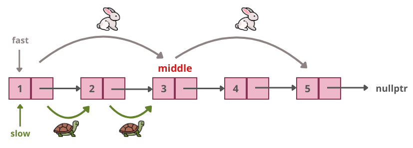
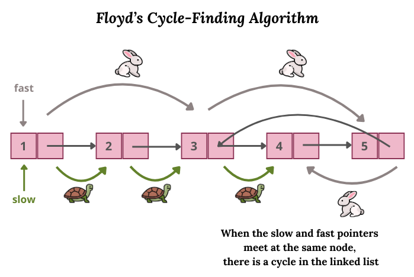

# Операции върху едносвързан списък

## Описание на структурата на едносвързан списък

```c++
struct Node {
    int data;
    Node* next;

    Node(int val, Node* next = nullptr) : data(val), next(next) {}
};
```

- ***data:*** съдържа стойността на възела (в случая - цяло число)
- ***next:*** указател, който сочи към следващия възел в списъка

## 1. Намиране на среда на едносвързан списък

Използваме два указателя: бавен (`slow`) и бърз (`fast`). Двата указателя започват от началото и на всяка итерация:
- ***slow*** се придвижва с една стъпка напред
- ***fast*** се придвижва с две стъпки напред

Когато `fast` достигне края на списъка, `slow` ще сочи към средния възел.

```c++
Node* findMiddle(Node* head) {
    Node* slow = head;
    Node* fast = head;
    
    while (fast && fast->next) {
        slow = slow->next;       // Бавният указател (slow) се придвижва с 1 стъпка
        fast = fast->next->next; // Бързият указател (fast) се придвижва с 2 стъпки
    }
    
    return slow; // slow се намира на средния възел на списъка
}
```

### Пример
**Списък:** `1 -> 2 -> 3 -> 4 -> 5 -> nullptr`

1. В началото `slow` и `fast` сочат към **1**.
2. **Итерация 1:** `slow` се премества на **2**, а `fast` на **3**.
3. **Итерация 2:** `slow` се премества на **3**, а `fast` на **5**.
4. **Итерация 3:** `fast` достига края на списъка, така че `slow` сочи към средния възел **3**.

### Сложност
- **Сложност по време:** `O(n)`, където n е броят на възлите в списъка. 
- **Сложност по памет:** `O(1)`, тъй като използваме само два указателя.



## 2. Проверка за цикъл в едносвързан списък
Използваме алгоритъма на Флойд (или техника с два указателя) за намиране на цикъл в едносвързан списък.
- `slow` и `fast` започват от началото на списъка.
- `slow` се движи с една стъпка, докато `fast` се движи с две стъпки.
Ако съществува цикъл, `slow` и `fast` ще се срещнат в някакъв момент. Ако `fast` достигне края на списъка, значи няма цикъл.

 ```cpp
bool hasCycle(Node* head) {
Node* slow = head;
Node* fast = head;

    while (fast && fast->next) {
        slow = slow->next;         // slow се придвижва с 1 стъпка
        fast = fast->next->next;   // fast се придвижва с 2 стъпки
        
        if (slow == fast) {
            return true; // Открит е цикъл
        }
    }
    
    return false; // Няма цикъл
}
```

### Пример
**Списък с цикъл:** `1 -> 2 -> 3 -> 4 -> 5 -> 3` (връщане към 3)

1. В началото `slow` и `fast` сочат към **1**.
2. **Итерация 1:** `slow` се премества на **2**, а `fast` на **3**.
3. **Итерация 2:** `slow` се премества на **3**, а `fast` на **5**.
4. **Итерация 3:** `slow` се премества на **4**, а `fast` отново достига до **3**.
5. **Итерация 4:** `slow` и `fast` се срещат, което потвърждава наличието на цикъл.

### Сложност
- **Сложност по време:** `O(n)`, където n е броят на възлите в списъка.
- **Сложност по памет:** `O(1)`, тъй като използваме само два указателя.



## 3. Обръщане на едносвързан списък

```cpp
Node* reverseList(Node* head) {
    Node* prev = nullptr;  // Първоначално няма предишен възел
    Node* current = head;  // Започваме от началния възел
    
    while (current) {
        Node* nextNode = current->next; // Запазваме следващия възел
        current->next = prev;           // Обръщаме указателя на текущия възел към предишния
        prev = current;                 // Преместваме prev на текущия възел
        current = nextNode;             // Преместваме current на следващия възел
    }
    
    return prev; // Новата глава на обърнатия списък
}
```

### Пример
**Оригинален списък:** `1 -> 2 -> 3 -> 4 -> 5 -> nullptr`

1. В началото `prev` е `nullptr`, а `current` сочи към **1**.
2. **Итерация 1:**
    - `nextNode = 2`
    - `current->next = nullptr`
    - `prev = 1`
    - `current = 2`
3. **Итерация 2:**
    - `nextNode = 3`
    - `current->next = 1`
    - `prev = 2`
    - `current = 3`
4. **Итерация 3:**
    - `nextNode = 4`
    - `current->next = 2`
    - `prev = 3`
    - `current = 4`
5. **Итерация 4:**
    - `nextNode = 5`
    - `current->next = 3`
    - `prev = 4`
    - `current = 5`
6. **Итерация 5:**
    - `nextNode = nullptr`
    - `current->next = 4`
    - `prev = 5`
    - `current = nullptr`

След като `current` стане `nullptr`, връщаме `prev`, който сочи към новата глава на обърнатия списък: `5 -> 4 -> 3 -> 2 -> 1 -> nullptr`.

### Сложност
- **Сложност по време:** `O(n)`, където n е броят на възлите в списъка.
- **Сложност по памет:** `O(1)`, тъй като използваме само три указателя.


