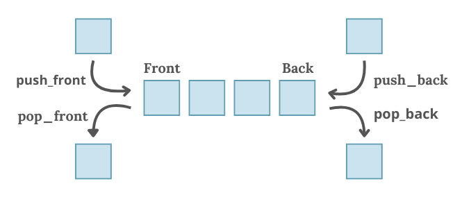

# <span style="color:lightblue;">Въведение в структурата от данни Дек</span>

Декът (<span style="color:lightblue;">**Deque**</span>, съкратено от *Double-Ended Queue*) е линейна структура от данни, която позволява добавяне и премахване на елементи както в началото, така и в края на структурата. Декът е изключително гъвкава структура и може да се използва за имплементиране на стандартна опашка или стек.

---

## <span style="color:lightblue;">Основни операции</span>

- **push_front** – добавя елемент в началото на дека със сложност `O(1)`
- **push_back** – добавя елемент в края на дека със сложност `O(1)`
- **pop_front** – премахва елемент от началото на дека със сложност `O(1)`
- **pop_back** – премахва елемент от края на дека със сложност `O(1)`

## <span style="color:lightblue;">Допълнителни операции</span>

- **front** – връща първия елемент от дека със сложност `O(1)`
- **back** – връща последния елемент от дека със сложност `O(1)`
- **empty** – проверява дали декът е празен със сложност `O(1)`
- **size** – връща броя на елементите в дека със сложност `O(1)`



---

## <span style="color:lightblue;">Примерен дек</span>

В стандартната библиотека на C++ има готова реализация на дек. Тя се намира в библиотеката `<deque>` и може да се използва чрез `std::deque<T>`.

```c++
#include <iostream>
#include <deque>

int main() {
    std::deque<int> d;

    d.push_back(1);  // добавяме в края
    d.push_front(2); // добавяме в началото
    d.push_back(3);  // добавяме в края
    d.push_front(4); // добавяме в началото

    std::cout << "Front element: " << d.front() << std::endl; // Извеждаме първия елемент в дека -> 4
    std::cout << "Back element: " << d.back() << std::endl;  // Извеждаме последния елемент в дека -> 3

    d.pop_front(); // премахваме първия елемент
    d.pop_back(); // премахваме последния елемент

    std::cout << "Deque elements after pop operations: ";
    for (int elem : d) {
        std::cout << elem << " "; // Извеждаме елементите в дека -> 2 1
    }
    std::cout << std::endl;
}
```

---

## <span style="color:lightblue;">Приложения на дека</span>

1. **Имплементиране на опашка** – чрез използване на операциите `push_back` и `pop_front`, декът може да действа като стандартна опашка (*FIFO*)
2. **Имплементиране на стек** – чрез `push_back` и `pop_back`, декът може да се използва като стек (*LIFO*), което предоставя бърз достъп до последно добавения елемент
