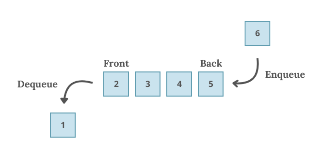

# <span style="color:lightblue;">Въведение в структурата от данни Опашка</span>

Опашката (<span style="color:lightblue;">***Queue***</span>) е линейна структура от данни, която следва принципа **„Първи влязъл, първи излязъл“** (*FIFO – First In, First Out*). Това означава, че елементът, който е добавен първи, ще бъде изваден пръв. Можем да си представим опашката като реална опашка, където новопристигналите застават накрая и чакат своя ред.

---

## <span style="color:lightblue;">Основни операции</span>

- **enqueue (или push)** – добавя елемент в края на опашката със сложност `O(1)`
- **dequeue (или pop)** – премахва елемент от началото на опашката със сложност `O(1)`

## <span style="color:lightblue;">Допълнителни операции</span>

- **front** – връща първия елемент в опашката със сложност `O(1)`
- **back** – връща последния елемент от опашката със сложност `O(1)`
- **empty** – проверява дали опашката е празна със сложност `O(1)`
- **size** – връща броя на елементите в опашката със сложност `O(1)`




---

## <span style="color:lightblue;">Примерна опашка</span>

В стандартната библиотека на C++ има готова реализация на опашка. Тя се намира в библиотеката `<queue>` и може да се използва чрез `std::queue<T>`.

```c++
#include <iostream>
#include <queue>

int main() {
    std::queue<int> q;

    // Добавяме елементи в опашката
    q.push(1);
    q.push(2);
    q.push(3);
    q.push(4);
    q.push(5);

    std::cout << "Front element: " << q.front() << std::endl; // Извеждаме първия елемент в опашката -> 1

    q.pop(); // Премахваме първия елемент в опашката -> 1

    std::cout << "Front element after pop: " << q.front() << std::endl; // Извеждаме първия елемент в опашката след премахване -> 2

    std::cout << "Back element: " << q.back() << std::endl; // Извеждаме последния елемент в опашката -> 5

    std::cout << std::boolalpha << "Is queue empty: " << q.empty() << std::endl; // Проверяваме дали опашката е празна -> false

    std::cout << "Size of queue: " << q.size() << std::endl; // Извеждаме размера на опашката -> 4

    // Премахваме всички елементи от опашката
    while (!q.empty())
        q.pop();

    std::cout << std::boolalpha << "Is queue empty: " << q.empty() << std::endl; // Проверяваме дали опашката е празна -> true
}
```

--- 

## <span style="color:lightblue;">Примерна задача</span>
Напишете функция, която генерира всички двоични числа от 1 до n (в десетичен вид).

***Пример:*** <br>
**Вход:** `n = 10` <br>
**Изход:** `1 10 11 100 101 110 111 1000 1001 1010`

<details>
<summary>Примерно решение</summary>

```c++
#include <iostream>
#include <queue>
#include <string>

void generateBinaryNumbers(int n) {
    std::queue<std::string> q;
    
    q.push("1");

    for (int i = 1; i <= n; ++i) {
        std::string current = q.front();
        q.pop();
        
        std::cout << current << " ";

        q.push(current + "0");
        q.push(current + "1");
    }
}

int main() {
    int n = 10;
    std::cout << "Двоични числа от 1 до " << n << ": ";
    generateBinaryNumbers(n);

    return 0;
}
```
</details>

---

## <span style="color:lightblue;">Приложения на опашката</span>

1. **Алгоритъм за обхождане на графи (BFS)** - използва опашка, за да обхожда графа ниво по ниво, като обработва всеки връх и неговите съседи в реда на достигане
2. **Опашка от задачи** - моделира обработката на задачи, които чакат да бъдат изпълнени в реда, в който са получени
> Например, ако няколко процеса чакат да бъдат изпълнени от процесора, те се добавят в опашка в реда на постъпване. Така процесорът ги изпълнява един по един, което осигурява равноправен достъп до ресурсите.
3. **Маршрутизация на пакети** - използва се за управление на пакети в мрежата, където първият пристигнал пакет се пренасочва пръв
> Например при изпращане на данни по мрежа, пакетите се поставят в опашка, докато чакат обработка. Това позволява на маршрутизатора да обработва пакетите в реда на постъпване, осигурявайки подреден и ефективен трафик
4. **Симулация на реалния свят** - например обслужване на клиенти в банка, където първият клиент, който влезе в опашката, ще бъде обслужен първи

---

## <span style="color:lightblue;">Задачи (за упражнение вкъщи)</span>

1. [2073. Time Needed to Buy Tickets](https://leetcode.com/problems/time-needed-to-buy-tickets/description/)
2. [387. First Unique Character in a String](https://leetcode.com/problems/first-unique-character-in-a-string/description/)
3. [950. Reveal Cards In Increasing Order](https://leetcode.com/problems/reveal-cards-in-increasing-order/description/)
4. [239. Sliding Window Maximum](https://leetcode.com/problems/sliding-window-maximum/description/)

