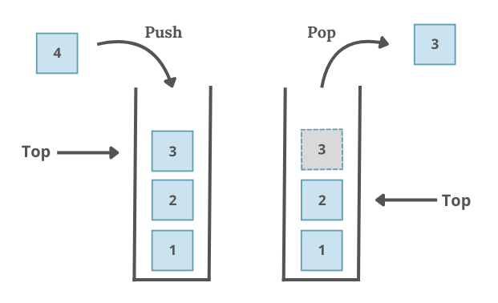

# <span style="color:lightblue;">Въведение в структурата от данни Стек</span>

Стекът (<span style="color:lightblue;">***Stack***</span>) е линейна структура от данни, която следва принципа **„Първи влязъл, последен излязъл“** (*FILO – First In, Last Out*). Това означава, че елементът, който е добавен първи, ще бъде изваден последен. Можем да си представим стекът като наредени дискове. За да вземем този най-отдолу(първия диск) трябва да извадим всички останали.

---

## <span style="color:lightblue;">Основни операции</span>

- **push** – добавя елемент на върха на стека със сложност `O(1)`
- **pop** – премахва елемент от върха на стека със сложност `O(1)`

## <span style="color:lightblue;">Допълнителни операции</span>

- **top** – връща елемента на върха на стека със сложност `O(1)`
- **empty** – проверява дали стекът е празен със сложност `O(1)`
- **size** – връща броя на елементите в стека със сложност `O(1)`




---

## <span style="color:lightblue;">Примерна задача</span>

Да се реализира функция, която проверява дали скобите в даден израз са правилно подредени. Изразът може да съдържа три вида скоби: `[]`, `{}`, и `()`. Функцията трябва да върне `True`, ако всички скоби са коректно затворени и вложени, и `False` в противен случай. Игнорират се всички други символи извън тези видове скоби.

***Примерен вход и изход:***
<br>`([({})])` -> `True`
<br>`(((()` -> `False`
<br>`([)]` -> `False`

<details>
<summary>Примерно решение</summary>

```c++
#include <iostream>
#include <stack>
bool validateParentheses(const std::string& str)
{
    std::stack<char> s;

    for (char ch : str)
    {
        switch (ch)
        {

        case '(':
        case '[':
        case '{': 
            s.push(ch);
            break;

        case ')': 
            if (s.top() != '(') 
                return false;
            s.pop();
            break;
        case ']':            
            if (s.top() != '[') 
                return false;
            s.pop();
            break;
        case '}':            
            if (s.top() != '{')
                return false;
            s.pop();
            break;
        default:
            break;
        }
    }
    return s.empty();   
}
```
</details>

---

## <span style="color:lightblue;">Приложения на стек</span>

1. **Алгоритъм за обхождане на графи/дърво (DFS)** - използва стек, за да обхожда графа/дървото в дълбочина, като обработва всеки връх и неговите наследници
2. **Undo и Redo функционалност** - Всяко действие, което потребителят извършва, се добавя в стек за отмяна. При undo, се извършва обратната операция на тази от върха на стека и се добавя в друг стек, който ще се използва за redo.
---